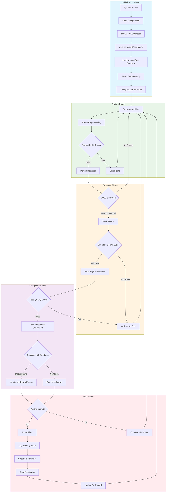
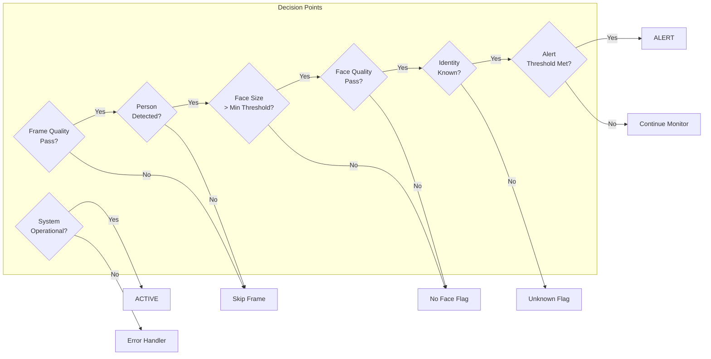
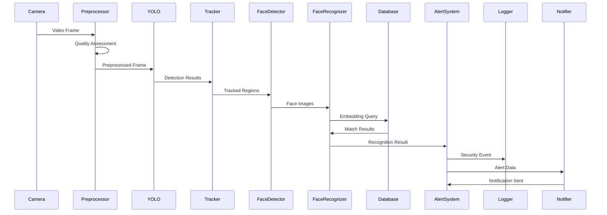
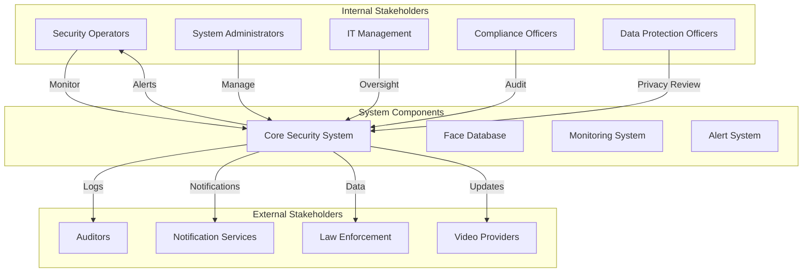
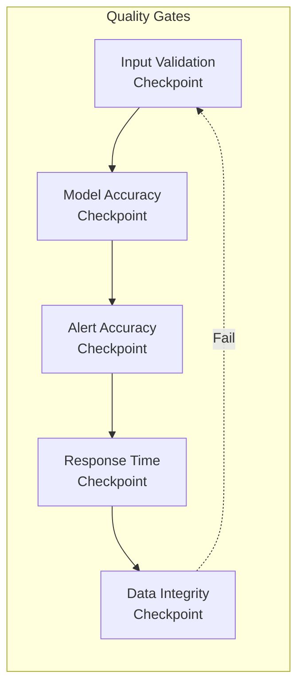
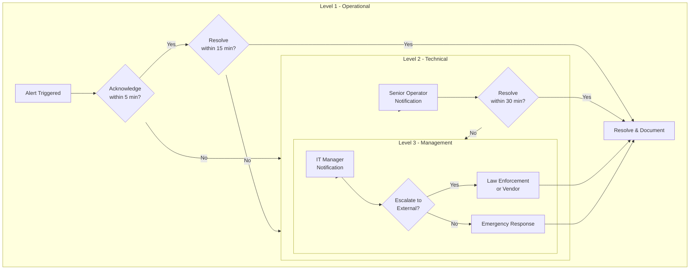
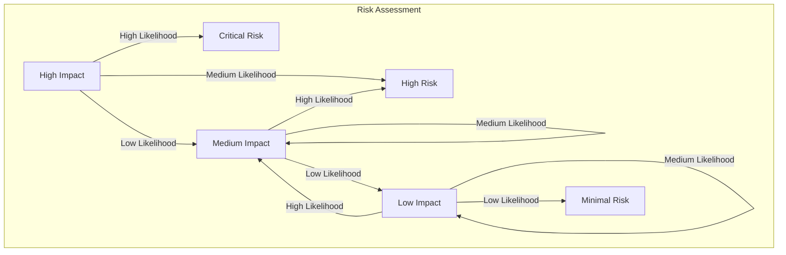
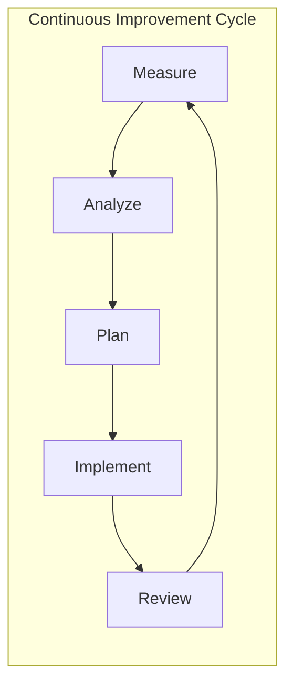

# Security Alert System with Face Recognition - Operational Workflow

## Document Information

| Attribute | Value |
|-----------|-------|
| Document Version | 1.0 |
| Classification | Operational Documentation |
| Framework | ISO 9001:2015 / ISO 27001:2022 Aligned |
| Last Updated | 2026-03-12 |

---

## 1. Executive Summary

This document defines the comprehensive operational workflow for the Security Alert System with Face Recognition. The system integrates YOLO (You Only Look Once) computer vision models for person detection, tracking, and pose estimation with InsightFace for facial recognition, attribute analysis, and identity management.

---

## 2. Process Stages Overview

### 2.1 Main Process Flow

### 2.2 Detailed Stage Descriptions

| Stage ID | Stage Name | Description | Expected Output |
|----------|------------|-------------|-----------------|
| INIT-01 | System Startup | Initialize all system components | System ready state |
| INIT-02 | Configuration Load | Load security parameters and thresholds | Configuration object |
| INIT-03 | Model Initialization | Load YOLO and InsightFace models | Loaded models in memory |
| CAP-01 | Frame Acquisition | Capture video frames from source | Raw frame data |
| CAP-02 | Preprocessing | Apply filters and normalization | Preprocessed frame |
| DET-01 | Person Detection | Run YOLO inference | Detection boxes |
| DET-02 | Tracking | Apply object tracking algorithm | Tracked trajectories |
| REC-01 | Face Extraction | Extract face regions | Face images |
| REC-02 | Embedding Generation | Generate face embeddings | Feature vectors |
| REC-03 | Face Matching | Compare embeddings with database | Match results |
| ALERT-01 | Alert Decision | Evaluate alert conditions | Boolean decision |
| ALERT-02 | Alarm Activation | Trigger alarm systems | Alarm state |
| ALERT-03 | Notification | Send alerts to stakeholders | Notification data |

---

## 3. Decision Points

### 3.1 Decision Matrix

### 3.2 Decision Criteria

| Decision Point | Criteria | Thresholds | Actions |
|----------------|----------|------------|---------|
| Frame Quality | Brightness, Sharpness, Contrast | ≥ 0.5 composite score | Skip if below threshold |
| Person Detection | YOLO confidence | ≥ 0.6 confidence | Proceed if detected |
| Face Size | Minimum bounding box | ≥ 40x40 pixels | Flag as no face if below |
| Face Quality | Yaw angle, clarity | ≤ 45° rotation, ≥ 0.4 quality | Skip recognition if poor |
| Identity Match | Cosine similarity | ≥ 0.5 tolerance | Unknown if below |
| Alert Threshold | Detection count | ≥ 1 unknown person | Trigger alert |

---

## 4. Input/Output Specifications

### 4.1 System Inputs

| Input Type | Source | Format | Frequency |
|------------|--------|--------|-----------|
| Video Stream | Camera/API | RGB, MJPEG | 30 FPS |
| Configuration | YAML/JSON | YAML/JSON | On startup |
| Face Database | Local storage | NumPy arrays | On startup |
| Model Weights | Model directory | .pt files | On startup |

### 4.2 System Outputs

| Output Type | Destination | Format | Frequency |
|-------------|-------------|--------|-----------|
| Alert Events | Security Dashboard | JSON | On trigger |
| Screenshots | Local storage | JPEG/PNG | On alert |
| Event Logs | Log files | Structured text | Real-time |
| Notifications | Email/Push | SMTP/Webhook | On alert |
| Metrics | Monitoring System | Prometheus | 1-minute intervals |

### 4.3 Data Flow Diagram

---

## 5. Role Responsibilities

### 5.1 RACI Matrix

| Activity | Security Operator | System Admin | IT Manager | Compliance Officer | Data Protection Officer |
|----------|:---:|:---:|:---:|:---:|:---:|
| System Monitoring | R | I | I | - | - |
| Alert Response | R | C | I | - | - |
| Configuration Management | A | R | C | C | C |
| Model Updates | C | R | A | C | I |
| Database Management | I | R | A | C | R |
| Incident Investigation | R | C | A | R | C |
| Compliance Audits | I | C | A | R | R |
| Report Generation | R | C | A | R | I |
| System Maintenance | C | R | A | - | - |
| Access Control | A | R | C | C | R |

**Legend:** R = Responsible, A = Accountable, C = Consulted, I = Informed

### 5.2 Role Definitions

#### Security Operator
- **Responsibilities:** Real-time monitoring, alert acknowledgment, initial incident assessment
- **Authority:** Acknowledge alerts, adjust monitoring sensitivity within bounds
- **Competencies:** Security operations, incident response, system monitoring

#### System Administrator
- **Responsibilities:** System deployment, configuration, maintenance, troubleshooting
- **Authority:** System configuration, user management, resource allocation
- **Competencies:** System administration, networking, security software

#### IT Manager
- **Responsibilities:** Strategic planning, budget management, vendor relations
- **Authority:** Resource allocation, policy approval, vendor selection
- **Competencies:** IT management, strategic planning, risk assessment

#### Compliance Officer
- **Responsibilities:** Regulatory compliance, audit coordination, policy enforcement
- **Authority:** Compliance audits, policy exceptions, regulatory reporting
- **Competencies:** Regulatory knowledge, audit procedures, risk compliance

#### Data Protection Officer
- **Responsibilities:** Data privacy, PII handling, consent management
- **Authority:** Data processing approvals, privacy impact assessments
- **Competencies:** Privacy regulations, data governance, legal compliance

---

## 6. Stakeholder Interactions

### 6.1 Stakeholder Map

### 6.2 Communication Protocols

| Stakeholder | Communication Channel | Frequency | Escalation Path |
|-------------|----------------------|-----------|-----------------|
| Security Operators | Dashboard, Email | Real-time | Shift Supervisor |
| System Administrators | Ticketing System | On-incident | IT Manager |
| IT Management | Reports, Meetings | Weekly | CEO/Board |
| Compliance Officers | Audit Reports | Monthly/Quarterly | Regulatory Body |
| Law Enforcement | Secure Channel | On-authorized-request | Direct |
| Auditors | Secure Portal | Scheduled | Compliance Officer |

---

## 7. Compliance Requirements

### 7.1 Regulatory Framework Alignment

| Standard | Requirement | Implementation |
|----------|-------------|----------------|
| ISO 27001 | Information Security Management | Access controls, encryption, audit logs |
| GDPR | Data Protection | Consent management, data minimization, PII handling |
| CCPA | Consumer Privacy | Data access requests, deletion rights |
| SOC 2 | Security Availability | Redundancy, monitoring, incident response |

### 7.2 Data Handling Requirements

| Data Category | Retention Period | Access Level | Encryption |
|---------------|-------------------|--------------|------------|
| Face Embeddings | 90 days | Restricted | AES-256 |
| Event Logs | 1 year | Audit | TLS 1.3 |
| Screenshots | 30 days | Security | AES-256 |
| System Logs | 90 days | Admin | TLS 1.3 |
| Configuration | Permanent | Admin | Encrypted |

### 7.3 Audit Requirements

| Audit Type | Frequency | Scope | Deliverable |
|------------|-----------|-------|-------------|
| Security Audit | Quarterly | System configuration, access logs | Audit Report |
| Privacy Audit | Annual | Data handling, consent | Compliance Certificate |
| Performance Audit | Monthly | System metrics, capacity | Performance Report |
| Incident Review | Post-incident | Root cause analysis | Incident Report |

---

## 8. Quality Control Checkpoints

### 8.1 Quality Gates

### 8.2 Quality Metrics

| Metric | Target | Measurement | Action |
|--------|--------|-------------|--------|
| Detection Accuracy | ≥ 95% | True Positive Rate | Model retraining |
| False Positive Rate | ≤ 2% | False Alarm Ratio | Threshold adjustment |
| Recognition Accuracy | ≥ 90% | Identity Match Rate | Database update |
| Alert Response Time | ≤ 5 seconds | End-to-end latency | Performance tuning |
| System Uptime | ≥ 99.9% | Availability | Redundancy review |

### 8.3 Testing Requirements

| Test Type | Frequency | Coverage | Acceptance Criteria |
|-----------|-----------|----------|---------------------|
| Unit Testing | Every commit | ≥ 80% | All tests pass |
| Integration Testing | Weekly | All interfaces | No regressions |
| Performance Testing | Monthly | Full system | Meets SLA |
| Security Testing | Quarterly | Full attack surface | No critical findings |
| User Acceptance | Pre-release | End-to-end | Stakeholder sign-off |

---

## 9. Escalation Procedures

### 9.1 Escalation Levels

### 9.2 Escalation Criteria

| Severity | Definition | Response Time | Escalation Path |
|----------|------------|---------------|-----------------|
| Critical | Active threat, confirmed breach | Immediate | Level 1 → Level 2 → Level 3 |
| High | Suspected unauthorized access | 5 minutes | Level 1 → Level 2 |
| Medium | Anomalous behavior detected | 15 minutes | Level 1 |
| Low | Minor system irregularity | 1 hour | Monitor only |

### 9.3 Contact Matrix

| Time Period | Primary Contact | Backup Contact | Contact Method |
|-------------|-----------------|----------------|----------------|
| Business Hours (8-6) | Security Operator | Shift Supervisor | Direct/Phone |
| After Hours | On-call Operator | IT Manager | Mobile/Phone |
| Weekend/Holiday | On-call Operator | Emergency Services | Mobile/Phone |

---

## 10. Performance Metrics

### 10.1 Key Performance Indicators

| KPI | Description | Target | Measurement |
|-----|-------------|--------|-------------|
| Detection FPS | Frames processed per second | ≥ 25 FPS | System monitoring |
| Recognition Latency | Time from face to identification | ≤ 500ms | Transaction timing |
| Alert Precision | True alerts / Total alerts | ≥ 95% | Alert audit |
| System Availability | Uptime / Total time | ≥ 99.9% | Uptime monitoring |
| Mean Time to Detect | Average detection time | ≤ 2 seconds | Incident timing |
| Mean Time to Respond | Average response time | ≤ 5 minutes | Incident timing |

### 10.2 Dashboard Metrics

| Metric Category | Metrics | Refresh Rate |
|-----------------|---------|--------------|
| Real-time | Active users, Current alerts, FPS | 1 second |
| Operational | Daily alerts, Response times | 1 minute |
| Analytical | Weekly trends, Monthly reports | 1 hour |
| Historical | Monthly trends, Annual reports | 24 hours |

### 10.3 SLA Definitions

| Service Level | Metric | Target | Penalty |
|---------------|--------|--------|---------|
| System Availability | Uptime | 99.9% | Service credit |
| Alert Response | Initial response | ≤ 5 min | Performance review |
| Resolution | Problem resolution | ≤ 4 hours | Escalation |
| Support | Help desk response | ≤ 30 min | SLA breach |

---

## 11. Risk Management Protocols

### 11.1 Risk Register

| Risk ID | Risk Description | Likelihood | Impact | Mitigation |
|---------|------------------|------------|--------|------------|
| R-001 | Unauthorized face database access | Low | Critical | Encryption, access controls |
| R-002 | System unavailability during incident | Medium | High | Redundancy, failover |
| R-003 | False positive alert fatigue | High | Medium | Threshold tuning, ML optimization |
| R-004 | Privacy regulation violation | Low | Critical | Compliance audit, consent management |
| R-005 | Model degradation over time | Medium | Medium | Regular retraining, monitoring |
| R-006 | Data breach | Low | Critical | Encryption, monitoring, incident response |

### 11.2 Risk Assessment Matrix

### 11.3 Mitigation Strategies

| Risk Category | Strategy | Implementation |
|---------------|----------|-----------------|
| Technical | Defense in Depth | Multiple security layers |
| Operational | Incident Response Plan | Documented procedures |
| Compliance | Regular Audits | Quarterly reviews |
| Privacy | Data Minimization | Collect only necessary data |

---

## 12. Documentation Guidelines

### 12.1 Required Documentation

| Document | Purpose | Owner | Review Frequency |
|----------|---------|-------|------------------|
| System Configuration | Technical setup | System Admin | Monthly |
| Operating Procedures | Daily operations | Security Lead | Quarterly |
| Incident Reports | Security events | Security Lead | Per incident |
| Audit Logs | Compliance evidence | Compliance Officer | Weekly |
| Change Log | System modifications | System Admin | Per change |

### 12.2 Documentation Standards

| Standard | Requirement |
|----------|-------------|
| Format | Markdown for procedures, PDF for formal docs |
| Version Control | Git with semantic versioning |
| Approval | Sign-off required for changes |
| Retention | Minimum 7 years for compliance |

### 12.3 Audit Trail Requirements

| Event Type | Logged Fields | Retention |
|------------|---------------|-----------|
| System Access | User, timestamp, action, result | 1 year |
| Configuration Changes | User, old value, new value, timestamp | 7 years |
| Alert Events | Alert type, timestamp, response, resolution | 1 year |
| Data Access | User, data accessed, purpose | 7 years |

---

## 13. Continuous Improvement

### 13.1 Improvement Process

### 13.2 Improvement Metrics

| Area | Metric | Target | Frequency |
|------|--------|--------|-----------|
| Detection | Model accuracy improvement | +2% per quarter | Quarterly |
| Operations | Response time reduction | -10% per quarter | Quarterly |
| User Satisfaction | Operator feedback score | ≥ 4.0/5.0 | Monthly |
| Compliance | Audit findings | 0 critical findings | Quarterly |

### 13.3 Review Schedule

| Review Type | Frequency | Participants | Output |
|-------------|-----------|--------------|--------|
| Operational Review | Weekly | Security team | Status report |
| Technical Review | Monthly | IT/Development | Technical report |
| Management Review | Quarterly | Leadership | Strategic plan |
| External Audit | Annual | External auditors | Compliance certificate |

---

## 14. Appendix

### 14.1 Glossary

| Term | Definition |
|------|------------|
| YOLO | You Only Look Once - object detection algorithm |
| InsightFace | Face analysis model for detection and recognition |
| Face Embedding | Numerical representation of facial features |
| False Positive | Incorrectly identified security alert |
| SLA | Service Level Agreement |

### 14.2 Reference Documents

- [Security Alarm System Guide](../en/guides/security-alarm-system.md)
- [Model Training Tips](../en/guides/model-training-tips.md)
- [System Deployment Options](../en/guides/model-deployment-options.md)

### 14.3 Change Log

| Version | Date | Changes | Author |
|---------|------|---------|--------|
| 1.0 | 2026-03-12 | Initial document creation | Documentation Team |

---

*This document follows ISO 9001:2015 and ISO 27001:2022 frameworks for operational excellence and information security management.*
